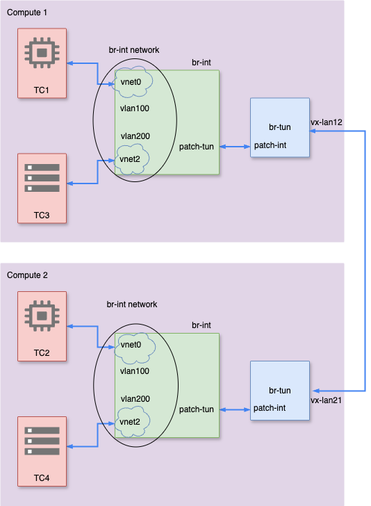

# OVS Lab

## Scenario:

## Pre Reqs:
create 2 vm and connect them together on virtual box,
Then on all nodes :
   ```sh
$ sudo apt install qemu-kvm libvirt-daemon libvirt-clients
$ sudo apt install virtinst
$ sudo apt install openvswitch-switch openvswitch-common
$ sudo apt install bridge-utils
$ sudo apt install libvirt-daemon-system
```
Next copy other files of the repo on all nodes using scp.

## Compute 2:
### Pre Reqs:

   ```sh
$ mkdir vm-images
$ mv tc-vm.img vm-images/
$ cd vm-images/
$ cp tc-vm.img tc2.img
$ cd ..
$ sudo ovs-vsctl add-br br-int
$ sudo ovs-vsctl add-br br-tun
$ virsh net-define ovsnet.xml
$ virsh net-start br-int
$ virsh net-autostart br-int
$ virsh net-destroy default
$ sh ./vmInstallTC_ovs.sh tc2 /home/ubuntu/vm-images/tc2.img br-int vlan-100
   ```
### Connect br-int to br-tun with patch:
   ```sh
   $ ovs-vsctl add-port br-int patch-tun -- set interface patch-tun type=patch options:peer=patch-int
   $ ovs-vsctl add-port br-tun patch-int -- set interface patch-int type=patch options:peer=patch-tun
   ```

### Create vxlan port and tunnel

```sh
$ ovs-vsctl add-port br-tun vxlan21 -- set interface vxlan21 type=vxlan options:{remote_ip=192.168.56.101,key=flow}
```
### Config flow table :
```sh
$ ovs-ofctl del-flows br-tun
$ ovs-ofctl add-flow br-tun priority=0,actions=drop
$ ovs-ofctl add-flow br-tun priority=10,in_port='patch-int',dl_vlan=100,actions='set_field:0x10->tun_id',strip_vlan,NORMAL
$ ovs-ofctl add-flow br-tun priority=10,in_port='vxlan21',tun_id=0x10,actions=mod_vlan_vid:100,output:'patch-int'
$ virsh console tc2
tc@box:/$ sudo ip a a 192.168.1.12/24 dev eth0

```
## Compute 1:
### Create bridges, networks, vlans and portgroups like compute 2
### Run TC1 and TC3 on compute1
```sh
$ virsh list
 Id   Name   State
----------------------
 3    tc1    running
 6    tc3    running
```
### Connect br-int to br-tun with patch
```sh
$ ovs-vsctl add-port br-int patch-tun -- set interface patch-tun type=patch options:peer=patch-int
$ ovs-vsctl add-port br-tun patch-int -- set interface patch-int type=patch options:peer=patch-tun
```
### Create vxlan port and tunnel:
```sh
$ ovs-vsctl add-port br-tun vxlan12 -- set interface vxlan12 type=vxlan options:{remote_ip=192.168.56.102,key=flow}
```
### Config flow table :
```sh
$ ovs-ofctl dump-flows br-tun cookie=0x0, duration=23130.676s, table=0, n_packets=261, n_bytes=89346, priority=0 actions=NORMAL
$ ovs-ofctl del-flows br-tun
$ ovs-ofctl add-flow br-tun priority=0,actions=drop 
$ ovs-ofctl add-flow br-tun priority=10,in_port='patch 
$ ovs-ofctl add-flow br-tun priority=10,in_port='vxlanput:'patch-int'
```

## Test tunnel:
```sh
$ virsh console tc1
tc@box:/$ sudo ip a del 192.168.1.1/24 dev eth0
tc@box:/$ sudo ip a a 192.168.1.11/24 dev eth0
tc@box:/$ ping 192.168.1.12
PING 192.168.1.12 (192.168.1.12): 56 data bytes
64 bytes from 192.168.1.12: seq=0 ttl=64 time=7.751 ms
64 bytes from 192.168.1.12: seq=1 ttl=64 time=2.556 ms
```
